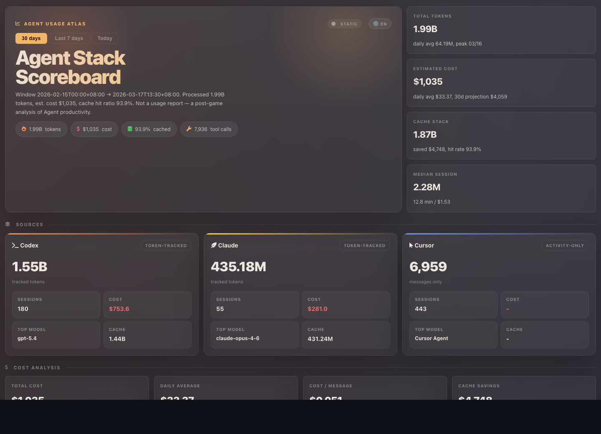
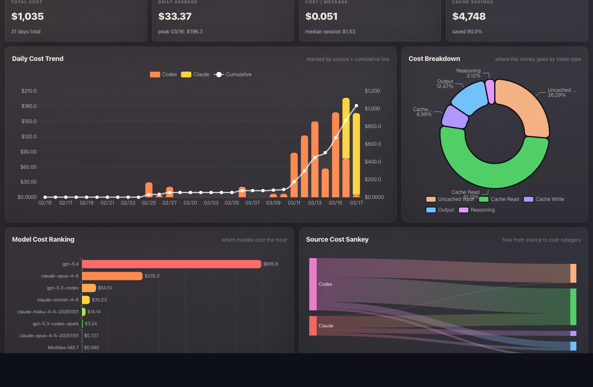
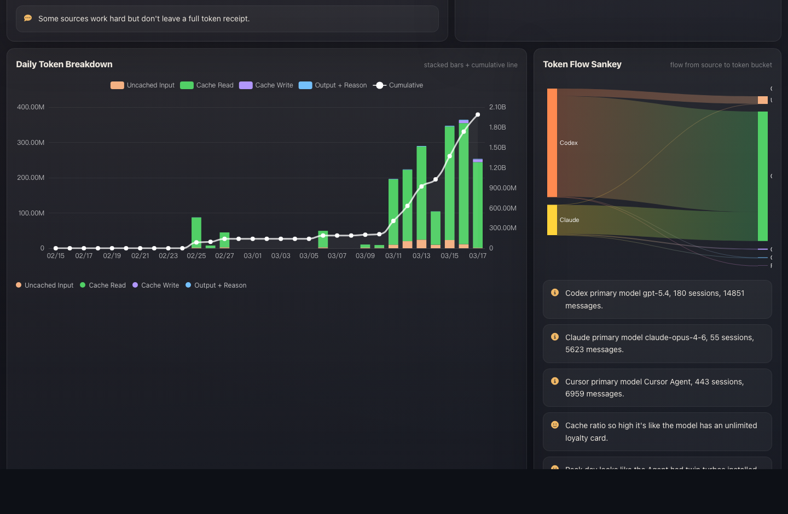
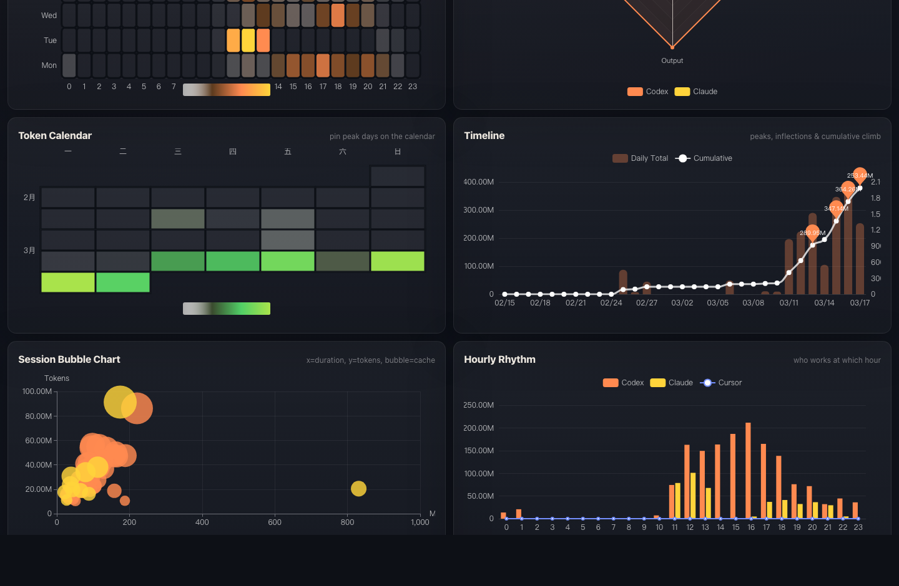
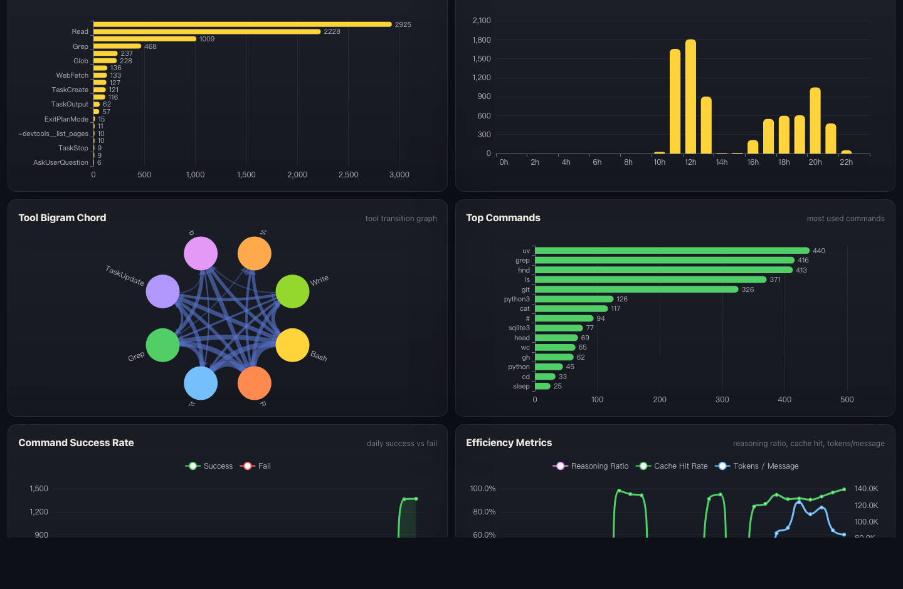

# Agent Usage Atlas

**English** | [中文](README_CN.md)

[](https://pypi.org/project/agent-usage-atlas/)
[](https://pypi.org/project/agent-usage-atlas/)
[](https://pypi.org/project/agent-usage-atlas/)
[](LICENSE)

> Turn your local AI coding agent logs into a rich, interactive analytics dashboard — zero dependencies, fully offline, one command.

<p align="center">
  <a href="https://heggria.github.io/agent-usage-atlas/demo/"><strong>Live Demo →</strong></a>
</p>

<!-- TODO: replace with GIF once recorded with vhs -->


## Why Agent Usage Atlas?

You're burning tokens across multiple AI coding agents every day — but **how much** are you actually spending? Which model is the most cost-effective? When are you most productive? Are your caches saving you money?

Agent Usage Atlas reads your local log files (`~/.codex/`, `~/.claude/`, `~/.cursor/`), crunches the numbers, and generates a single self-contained HTML dashboard with 25+ interactive charts. No API keys, no cloud uploads, no dependencies beyond Python itself.

## Supported Agents

| Agent | Token Tracking | Cost Estimation | Tool Call Tracking | Session Meta |
|-------|:-:|:-:|:-:|:-:|
| [Codex CLI](https://github.com/openai/codex) (GPT-5 family) | ✅ | ✅ | ✅ | ✅ |
| [Claude Code](https://docs.anthropic.com/en/docs/claude-code) (Claude 3–4.6) | ✅ | ✅ | ✅ | ✅ |
| [Cursor](https://www.cursor.com/) | Activity only | — | — | — |

> Pricing covers GPT-5.x, Claude 3/3.5/4.x (Haiku/Sonnet/Opus), and MiniMax-M2 out of the box.

## Features

- **25+ interactive ECharts visualizations** — cost trends, token breakdowns, Sankey flows, chord diagrams, heatmaps, radar charts, calendar views, burn rate projections
- **Multi-agent unified view** — Claude Code + Codex CLI + Cursor in one dashboard, with per-source drill-down
- **Cost analytics** — per-model, per-day, per-session cost estimation with 30-day burn rate forecasting
- **Tool call intelligence** — ranking, frequency density, bigram sequences, command success rates
- **Cache efficiency tracking** — hit rate, savings estimation, cache vs. uncached token split
- **Working pattern heatmap** — hour × weekday activity distribution to find your flow states
- **Session deep-dive** — duration histogram, complexity scatter, median session cost
- **Live dashboard mode** — SSE-powered auto-refresh server with date range tabs (All / 7 days / Today)
- **Bilingual narratives** — auto-generated story summaries in both Chinese and English
- **Animated data updates** — stock-style green/red flash on number changes in live mode
- **Single self-contained HTML** — one file, works offline, shareable, archivable
- **Zero dependencies** — pure Python standard library, no npm/Node/Rust/Docker required
- **Fully local** — all data stays on your machine, nothing sent anywhere

## Screenshots

<table>
<tr>
<td><strong>Cost Analysis</strong><br>Daily cost trends, cost breakdown by token type, model cost ranking, Sankey flow</td>
<td><strong>Token & Activity</strong><br>Daily token trends, source radar, narrative summary, rose chart</td>
</tr>
<tr>
<td></td>
<td></td>
</tr>
<tr>
<td><strong>Heatmap & Sessions</strong><br>Activity heatmap, source radar, token calendar, session bubble</td>
<td><strong>Tool Intelligence</strong><br>Tool ranking, bigram chord diagram, top commands, efficiency metrics</td>
</tr>
<tr>
<td></td>
<td></td>
</tr>
</table>

## Installation

### pip (recommended)

```bash
pip install agent-usage-atlas
```

### Homebrew

```bash
brew install heggria/tap/agent-usage-atlas
```

### From source

```bash
git clone https://github.com/heggria/agent-usage-atlas.git
cd agent-usage-atlas
pip install .
```

## Usage

```bash
# Default: last 30 days, output to ./reports/dashboard.html
python -m agent_usage_atlas

# Last 7 days
python -m agent_usage_atlas --days 7

# Custom start date
python -m agent_usage_atlas --since 2026-03-01

# Custom output path and auto-open in browser
python -m agent_usage_atlas --output /tmp/dashboard.html --open

# Start live dashboard with auto-refresh (SSE)
agent-usage-atlas --serve --interval 5 --open

# Live dashboard on custom host/port
agent-usage-atlas --serve --port 8765 --host 127.0.0.1 --interval 5
```

### CLI Options

| Flag | Description | Default |
|------|-------------|---------|
| `--days N` | Include the last N days | `30` |
| `--since YYYY-MM-DD` | Custom start date (overrides `--days`) | — |
| `--output PATH` | Output HTML file path | `./reports/dashboard.html` |
| `--open` | Open in browser after generation | off |
| `--serve` | Start local live dashboard server | off |
| `--host` | Host for `--serve` mode | `127.0.0.1` |
| `--port` | Port for `--serve` mode | `8765` |
| `--interval` | SSE refresh interval in seconds | `5` |

### Live Mode Endpoints

| Endpoint | Description |
|----------|-------------|
| `GET /` | Interactive HTML dashboard |
| `GET /api/dashboard?days=30` | JSON payload |
| `GET /api/dashboard?since=2026-03-01` | Custom date range |
| `GET /api/dashboard/stream?interval=5` | SSE stream (auto-refresh) |
| `GET /health` | Health check |

## How It Works

```
~/.codex/**/*.jsonl  ─┐
~/.claude/**/*.jsonl ─┼─→  Parse  →  Aggregate  →  Render  →  dashboard.html
~/.cursor/**/*.jsonl ─┘     (parallel)   (rollup)    (ECharts)
```

1. **Parse** — Reads JSONL log files and SQLite databases from each agent's local directory. Codex uses cumulative-delta token counting; Claude deduplicates by message ID; Cursor tracks activity counts.
2. **Aggregate** — Computes source rollups, daily rollups, session rollups, tool bigrams, chord diagram data, Sankey flows, burn rate projections, heatmaps, and narrative text.
3. **Render** — Injects the aggregated data into a self-contained HTML template with ECharts visualizations. In live mode, an SSE server pushes updates when log files change.

All data stays local — nothing is sent to any server.

## Comparison with Alternatives

| | Agent Usage Atlas | [ccusage](https://github.com/ryoppippi/ccusage) | [splitrail](https://github.com/Piebald-AI/splitrail) | [claudetop](https://github.com/GauravRatnawat/claudetop) | [Langfuse](https://github.com/langfuse/langfuse) | [Helicone](https://github.com/Helicone/helicone) |
|---|---|---|---|---|---|---|
| **Multi-agent** | Claude + Codex + Cursor | Claude + Codex + others | 10+ agents | Claude only | Any (via SDK) | Any (via proxy) |
| **Visualization** | 25+ interactive ECharts (CN+EN) | CLI tables | CLI + cloud | TUI (7 views) | Web dashboard | Web dashboard |
| **Self-contained HTML** | ✅ | — | — | — | — | — |
| **Zero dependencies** | ✅ Python stdlib | Node.js | Rust | Node.js | Docker + PG | Docker + infra |
| **Fully local** | ✅ | ✅ | Cloud optional | ✅ | Self-host | Self-host |
| **Live dashboard** | ✅ SSE | — | — | — | ✅ | ✅ |
| **Tool-call analytics** | Bigram, chord, Sankey | — | Basic | Basic | Via tracing | Via proxy |
| **Cache efficiency** | ✅ | — | — | Partial | — | — |
| **Burn rate projection** | ✅ | — | — | — | — | ✅ |
| **Setup** | `python -m agent_usage_atlas` | `npx ccusage` | Build from source | `npx claudetop` | Deploy stack | Deploy proxy |

### Key Differentiators

1. **Unified multi-agent dashboard** — the only tool that tracks Claude Code + Codex CLI + Cursor simultaneously from local logs in a single view
2. **Richest visualization suite** — 25+ chart types including Sankey flows, chord diagrams, tool-call bigrams, heatmaps, burn rate projections, calendar views
3. **True zero dependencies** — Python stdlib only, no npm/Node/Rust/Docker/database required
4. **Single self-contained HTML** — one file, works offline, email it to yourself, archive it
5. **Live SSE server** — real-time auto-refresh with date range switching (All / 7 days / Today)
6. **Cache efficiency analytics** — unique among local tools, tracks savings and hit rates
7. **Animated transitions** — smooth number counter animations with stock-style green/red flash on live data refresh
8. **Bilingual narrative** — auto-generated story/summary in both Chinese and English

## Architecture

```
src/agent_usage_atlas/
├── cli.py          # CLI entry point, build_dashboard_payload()
├── parsers.py      # Codex / Claude / Cursor log parsers
├── models.py       # UsageEvent, ToolCall, SessionMeta + pricing (GPT-5, Claude 3–4.6, MiniMax)
├── aggregation.py  # Full dashboard payload computation (CN + EN narratives)
├── template.py     # Self-contained HTML/CSS/JS template (number flash animations)
└── server.py       # Live SSE server (stdlib http.server)
```

## License

[MIT](LICENSE)
