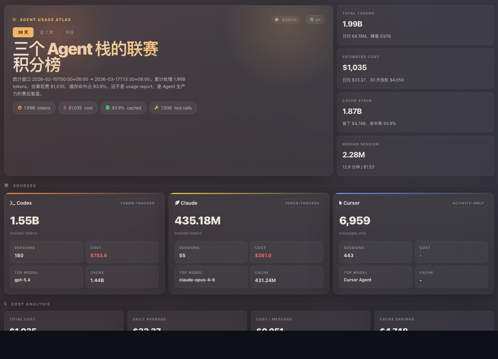
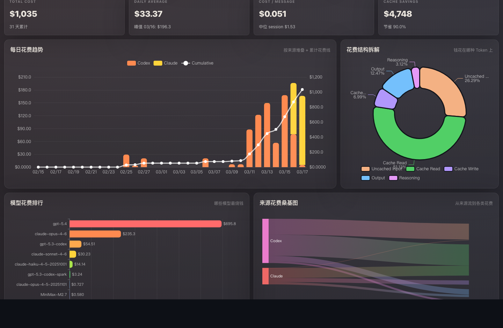
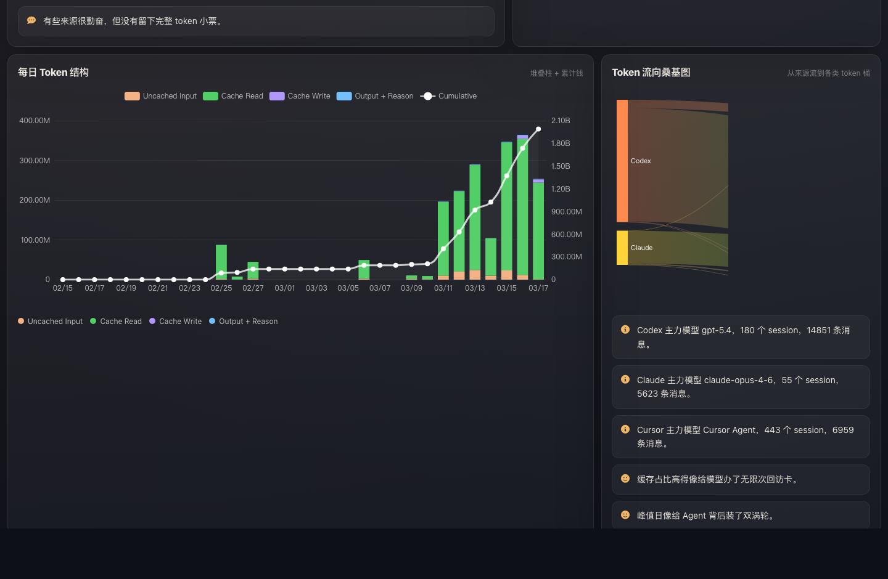
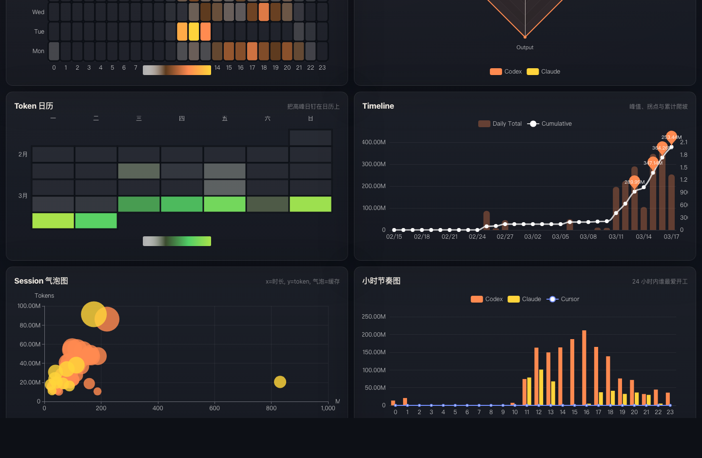
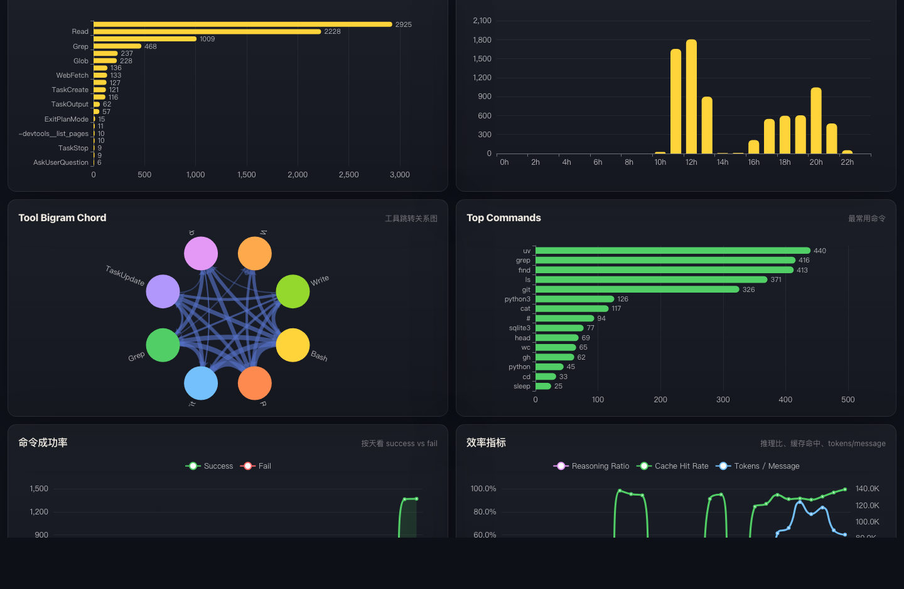

# Agent Usage Atlas

[](https://pypi.org/project/agent-usage-atlas/)
[](https://pypi.org/project/agent-usage-atlas/)
[](https://pypi.org/project/agent-usage-atlas/)
[](LICENSE)

> 一条命令，将本地 AI 编程 Agent 日志变成丰富的交互式分析仪表盘 — 零依赖、完全离线、开箱即用。

[English](README.md) | **中文**

<p align="center">
  <a href="https://heggria.github.io/agent-usage-atlas/demo/"><strong>在线体验 Demo →</strong></a>
</p>

<!-- TODO: 用 vhs 录制后替换为 GIF -->


## 为什么选择 Agent Usage Atlas？

你每天在多个 AI 编程 Agent 上消耗大量 token — 但你**到底花了多少钱**？哪个模型性价比最高？什么时段你最高效？缓存到底帮你省了多少？

Agent Usage Atlas 读取本地日志文件（`~/.codex/`、`~/.claude/`、`~/.cursor/`），自动计算各项指标，生成一个独立的 HTML 仪表盘，内含 25+ 交互式图表。无需 API Key，无需上传云端，除 Python 外零依赖。

## 支持的 Agent

| Agent | Token 追踪 | 费用估算 | 工具调用追踪 | 会话元数据 |
|-------|:-:|:-:|:-:|:-:|
| [Codex CLI](https://github.com/openai/codex)（GPT-5 系列） | ✅ | ✅ | ✅ | ✅ |
| [Claude Code](https://docs.anthropic.com/en/docs/claude-code)（Claude 3–4.6） | ✅ | ✅ | ✅ | ✅ |
| [Cursor](https://www.cursor.com/) | 仅活跃度 | — | — | — |

> 内置 GPT-5.x、Claude 3/3.5/4.x（Haiku/Sonnet/Opus）及 MiniMax-M2 定价表。

## 功能特性

- **25+ 交互式 ECharts 图表** — 费用趋势、Token 分布、桑基图、和弦图、热力图、雷达图、日历视图、烧钱速率预测
- **多 Agent 统一视图** — Claude Code + Codex CLI + Cursor 汇聚一屏，支持按来源下钻
- **费用分析** — 按模型、按天、按会话的费用估算，30 天烧钱速率预测
- **工具调用分析** — 排行榜、频率密度、二元组序列、命令成功率
- **缓存效率追踪** — 命中率、节省金额估算、缓存/非缓存 Token 占比
- **工作模式热力图** — 小时 × 星期活跃度分布，发现你的心流时段
- **会话深度分析** — 时长直方图、复杂度散点图、中位会话成本
- **实时仪表盘模式** — 基于 SSE 的自动刷新服务器，支持日期范围切换（全部 / 近 7 天 / 今天）
- **双语叙事摘要** — 自动生成中英文数据洞察故事
- **数据更新动画** — 实时模式下数字变化时的股票式红绿闪烁效果
- **单文件 HTML** — 一个文件，离线可用，可分享、可归档
- **零依赖** — 纯 Python 标准库，无需 npm/Node/Rust/Docker
- **完全本地** — 所有数据留在你的机器上，不会发送到任何地方

## 截图

<table>
<tr>
<td><strong>费用分析</strong><br>日费用趋势、Token 类型费用分布、模型费用排行、桑基流图</td>
<td><strong>Token 与活跃度</strong><br>日 Token 趋势、来源雷达图、叙事摘要、玫瑰图</td>
</tr>
<tr>
<td></td>
<td></td>
</tr>
<tr>
<td><strong>热力图与会话</strong><br>活跃度热力图、来源雷达图、Token 日历、会话气泡图</td>
<td><strong>工具调用分析</strong><br>工具排行、二元组和弦图、高频命令、效率指标</td>
</tr>
<tr>
<td></td>
<td></td>
</tr>
</table>

## 安装

### pip（推荐）

```bash
pip install agent-usage-atlas
```

### Homebrew

```bash
brew install heggria/tap/agent-usage-atlas
```

### 从源码安装

```bash
git clone https://github.com/heggria/agent-usage-atlas.git
cd agent-usage-atlas
pip install .
```

## 使用方法

```bash
# 默认：最近 30 天，输出到 ./reports/dashboard.html
python -m agent_usage_atlas

# 最近 7 天
python -m agent_usage_atlas --days 7

# 自定义起始日期
python -m agent_usage_atlas --since 2026-03-01

# 自定义输出路径并自动在浏览器中打开
python -m agent_usage_atlas --output /tmp/dashboard.html --open

# 启动实时仪表盘（SSE 自动刷新）
agent-usage-atlas --serve --interval 5 --open

# 自定义主机和端口
agent-usage-atlas --serve --port 8765 --host 127.0.0.1 --interval 5
```

### CLI 参数

| 参数 | 说明 | 默认值 |
|------|------|--------|
| `--days N` | 包含最近 N 天的数据 | `30` |
| `--since YYYY-MM-DD` | 自定义起始日期（覆盖 `--days`） | — |
| `--output PATH` | 输出 HTML 文件路径 | `./reports/dashboard.html` |
| `--open` | 生成后自动在浏览器中打开 | 关闭 |
| `--serve` | 启动本地实时仪表盘服务器 | 关闭 |
| `--host` | `--serve` 模式的主机地址 | `127.0.0.1` |
| `--port` | `--serve` 模式的端口号 | `8765` |
| `--interval` | SSE 刷新间隔（秒） | `5` |

### 实时模式接口

| 接口 | 说明 |
|------|------|
| `GET /` | 交互式 HTML 仪表盘 |
| `GET /api/dashboard?days=30` | JSON 数据 |
| `GET /api/dashboard?since=2026-03-01` | 自定义日期范围 |
| `GET /api/dashboard/stream?interval=5` | SSE 流（自动刷新） |
| `GET /health` | 健康检查 |

## 工作原理

```
~/.codex/**/*.jsonl  ─┐
~/.claude/**/*.jsonl ─┼─→  解析  →  聚合  →  渲染  →  dashboard.html
~/.cursor/**/*.jsonl ─┘   （并行）  （汇总）  （ECharts）
```

1. **解析** — 读取各 Agent 本地目录下的 JSONL 日志文件和 SQLite 数据库。Codex 使用累计增量 Token 计数；Claude 按消息 ID 去重；Cursor 统计活跃度。
2. **聚合** — 计算来源汇总、日汇总、会话汇总、工具二元组、和弦图数据、桑基流、烧钱速率预测、热力图及叙事文本。
3. **渲染** — 将聚合数据注入自包含的 HTML 模板，使用 ECharts 生成可视化图表。实时模式下，SSE 服务器在日志文件变化时推送更新。

所有数据保留在本地 — 不会发送到任何服务器。

## 与同类工具对比

| | Agent Usage Atlas | [ccusage](https://github.com/ryoppippi/ccusage) | [splitrail](https://github.com/Piebald-AI/splitrail) | [claudetop](https://github.com/GauravRatnawat/claudetop) | [Langfuse](https://github.com/langfuse/langfuse) | [Helicone](https://github.com/Helicone/helicone) |
|---|---|---|---|---|---|---|
| **多 Agent** | Claude + Codex + Cursor | Claude + Codex + 其他 | 10+ Agent | 仅 Claude | 任意（通过 SDK） | 任意（通过代理） |
| **可视化** | 25+ 交互式 ECharts（中英双语） | CLI 表格 | CLI + 云端 | TUI（7 个视图） | Web 仪表盘 | Web 仪表盘 |
| **单文件 HTML** | ✅ | — | — | — | — | — |
| **零依赖** | ✅ Python 标准库 | Node.js | Rust | Node.js | Docker + PG | Docker + 基础设施 |
| **完全本地** | ✅ | ✅ | 云端可选 | ✅ | 可自托管 | 可自托管 |
| **实时仪表盘** | ✅ SSE | — | — | — | ✅ | ✅ |
| **工具调用分析** | 二元组、和弦图、桑基图 | — | 基础 | 基础 | 通过追踪 | 通过代理 |
| **缓存效率** | ✅ | — | — | 部分 | — | — |
| **烧钱速率预测** | ✅ | — | — | — | — | ✅ |
| **上手方式** | `python -m agent_usage_atlas` | `npx ccusage` | 从源码构建 | `npx claudetop` | 部署全栈 | 部署代理 |

### 核心优势

1. **统一多 Agent 仪表盘** — 唯一一个从本地日志同时追踪 Claude Code + Codex CLI + Cursor 并汇聚在单一视图中的工具
2. **最丰富的可视化套件** — 25+ 图表类型，包括桑基流、和弦图、工具调用二元组、热力图、烧钱速率预测、日历视图
3. **真正的零依赖** — 纯 Python 标准库，无需 npm/Node/Rust/Docker/数据库
4. **单文件自包含 HTML** — 一个文件，离线可用，可邮件发送，可归档
5. **实时 SSE 服务器** — 实时自动刷新，支持日期范围切换（全部 / 近 7 天 / 今天）
6. **缓存效率分析** — 本地工具中独有，追踪节省金额和命中率
7. **数据更新动画** — 实时刷新时平滑的数字动画和股票式红绿闪烁
8. **双语叙事** — 自动生成中英文数据洞察故事/摘要

## 项目结构

```
src/agent_usage_atlas/
├── cli.py          # CLI 入口，build_dashboard_payload()
├── parsers.py      # Codex / Claude / Cursor 日志解析器
├── models.py       # UsageEvent, ToolCall, SessionMeta + 定价表（GPT-5, Claude 3–4.6, MiniMax）
├── aggregation.py  # 完整仪表盘数据计算（中英双语叙事）
├── template.py     # 自包含 HTML/CSS/JS 模板（数字闪烁动画）
└── server.py       # 实时 SSE 服务器（stdlib http.server）
```

## 许可证

[MIT](LICENSE)
